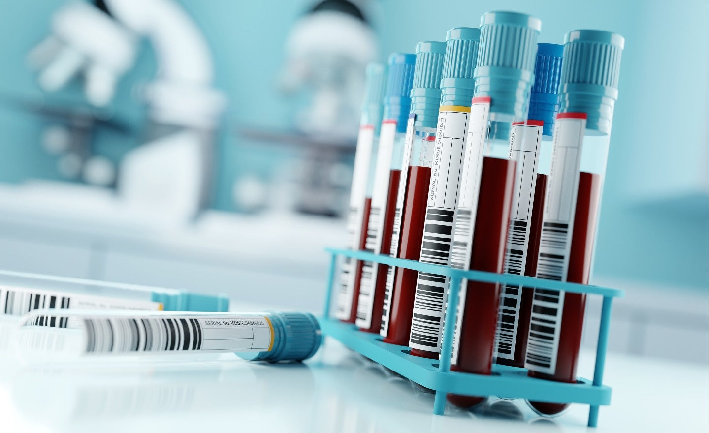

การตรวจเลือด (Blood testing) เป็นหนึ่งในวิธีการสำคัญเพื่อบ่งชี้การทำงานของอวัยะต่าง ๆ ภายในร่างกาย หรือเป็นการตรวจวิเคราะห์หาปัจจัยเสี่ยงของสุขภาพของแต่ละบุคคล ซึ่งจะช่วยให้แพทย์วินิจฉัยโรคหรือสภาวะบางอย่างที่ผิดปกติของร่างกายได้ เชื่อว่าผู้ป่วยหลาย ๆ ท่านหรือผู้ที่เข้ารับการตรวจสุขภาพเมื่อได้ใบผลการตรวจเลือดจากโรงพยาบาลนั้น มักจะไม่เข้าใจความหมายของค่าต่าง ๆ จากข้อจำกัดดังกล่าวบทความนี้จึงได้รวบรวมคำอธิบายและความหมายของค่าต่าง ๆ ไว้เพื่อช่วยให้หลาย ๆ ท่านได้เข้าใจผลเลือดของตนเองได้ดียิ่งขึ้น

อย่างไรก็ตามผลการตรวจเลือดเพียงอย่างเดียวไม่สามารถยืนยันความผิดปกติที่พบหรือโรคบางโรคได้ เนื่องจากโรคบางชนิดต้องอาศัยการตรวจหลายอย่างเพื่อยืนยันผลและมีหลายปัจจัยที่ทำให้ผลตรวจเลือดออกมาอยู่ในเกณฑ์ไม่ปกติ เช่น อาหารที่รับประทาน อยู่ในช่วงมีประจำเดือน การออกกำลังกาย ปริมาณแอลกอฮอล์ที่ดื่ม หรือการใช้ยาบางชนิด จึงจำเป็นต้องมีการตรวจในขั้นตอนต่อไปเพิ่มขึ้นตามดุลยพินิจของแพทย์ หรือตรวจซ้ำอีกครั้ง แต่อย่างไรก็ตามการตรวจเลือดเป็นวิธีการพื้นฐานที่สำคัญและจำเป็นที่จะใช้ในการวินิจฉัย ซึ่งในปัจจุบันการตรวจเลือดแบ่งได้หลายประเภทดังนี้

## การตรวจทางเคมีในเลือด (Blood Chemistry)

### น้ำตาลในเลือด (Blood sugar)
การเตรียมผู้ป่วย ผู้ป่วยอดอาหารก่อนการเจาะเลือด 8 ชั่วโมง (ดื่มน้ำเปล่าได้)
Glucose กลูโคสเป็นน้ำตาลชนิดสำคัญในร่างกายทำหน้าที่เป็นแหล่งพลังงานให้แก่เซลล์ต่าง ๆ ทางการแพทย์ใช้น้ำตาลกลูโคสเป็นสารบ่งชี้โรคเบาหวาน
##### ค่าปกติ
- ผู้ใหญ่ 70-100 mg/dL
- เด็ก 60-100 mg/dL
##### ค่าสูง
- 100-125 mg/dl มีความเสี่ยงต่อการเป็นเบาหวาน
- = 126 mg/dl เข้าได้กับเบาหวาน นัดมาตรวจเลือดซ้ำ ถ้าผลตรวจเลือดซ้ำ พบว่า FBS>= 126 mg/dl เป็นจำนวน 2 ใน 3 ครั้งถือว่าเป็นเบาหวาน

### HbA1c (Glycated hemoglobin) เป็นการตรวจวัด hemoglobin ซึ่งเป็นโปรตีนชนิดหนึ่งในเลือดที่สามารถเกิดปฏิกิริยาทางเคมีกับน้ำตาลที่อยู่ในเลือด และคงอยู่ในเลือดของเราได้นานถึง 8-12 สัปดาห์ ดังนั้นการตรวจวัดระดับของ HbA1c จึงสามารถใช้เป็นตัวบ่งชี้ค่าเฉลี่ยของระดับน้ำตาลในเลือด ณ ช่วงเวลา และใช้ติดตามการควบคุมระดับน้ำตาลในระยะยาวของผู้ป่วยเบาหวานได้
- ค่าปกติ 4.8-6.0 %
- ค่าสูง >6.5% เป็นเบาหวาน

### ไขมัน (Lipid profile)

วัตถุประสงค์ของการตรวจวัดระดับไขมันในเลือดเพื่อใช้บ่งชี้ความเสี่ยงต่อโรคหัวใจ โรคสมองขาดเลือดจากการอุดตัน หรือตีบตันของเส้นเลือด และใช้ติดตามการรักษาในผู้ป่วยที่ได้รับยาลดระดับไขมันในเลือด
#### การเตรียมผู้ป่วย ผู้ป่วยอดอาหารก่อนการเจาะเลือด 12 ชั่วโมง สำหรับการตรวจวัดระดับไขมันทุกชนิด (ดื่มน้ำเปล่าได้)
#### Low-density lipoprotein (LDL-cholesterol) เป็นไขมันชนิดที่ทำหน้าที่นำพา cholesterol ในกระแสเลือดเรียก LDL-cholesterol ว่า ไขมันเลว
- ค่าปกติ <100 mg/dL
- ค่าสูง - ไขมันในเลือดสูง อาจมีความเสี่ยงต่อโรคหลอดเลือดแข็ง (atherosclerosis) ส่งผลให้เกิดการตีบตันของเส้นเลือดในอวัยวะต่างๆ เช่น หัวใจ และสมอง
#### High-density lipoprotein (HDL-cholesterol) เป็นไขมันชนิดที่ทำหน้าที่เก็บกลับ cholesterol จากอวัยวะต่างๆ กลับเข้าสู่ตับซึ่งเป็นศูนย์กลางของกระบวนการสลายของไขมัน เรียก HDL-cholesterol ว่า ไขมันดี
- ค่าปกติ >40 mg/dL (ผู้หญิง), >50 mg/dL (ผู้ชาย)
- ค่าต่ำ - อาจมีความเสี่ยงต่อโรคหลอดเลือดแข็ง (atherosclerosis) ส่งผลให้เกิดการตีบตันของเส้นเลือดในอวัยวะต่างๆ เช่น หัวใจ และสมอง
#### Total cholesterol เป็นไขมันชนิดหนึ่ง ทำหน้าที่เป็นสารตั้งต้นในการผลิตฮอร์โมนต่างๆ เอนไซม์ และเป็นส่วนประกอบที่สำคัญของผนังเซลล์ การตรวจวัดระดับคลอเลสเตอรอลจะบ่งชี้ระดับไขมันโดยรวม ทั้ง HDL-cholesterol, LDL-cholesterol และ triglyceride ภายในเลือด

- ค่าปกติ <200 mg/dL
#### Triglyceride เป็นไขมันที่ถูกเก็บสะสมในร่างกายในเซลล์ไขมัน (adipose Tissue) ทำหน้าที่เป็นแหล่งพลังงานให้แก่ร่างกาย ปกติจะตรวจควบคู่กับไขมันตัวอื่นๆ
- ค่าปกติ <150 mg/dL
- ค่าสูง - ไขมันในเลือดสูง

### การทำงานของตับ (Liver function test)
#### การเตรียมผู้ป่วย ผู้ป่วยไม่ต้องอดอาหารก่อนการเจาะเลือด
#### Alanine aminotransferase (ALT)
 หรือ serum glutamate pyruvate transaminase (SGPT) เป็นเอนไซม์ชนิดหนึ่งที่พบได้ในเซลล์ตับ ดังนั้นค่า ALT ที่ตรวจพบในกระแสเลือดสามารถบ่งชี้หน้าที่และความผิดปกติที่เกิดที่เซลล์ตับ โดยค่าปกติคือ 0-48 IU/L หากพบความผิดปกติของค่าดังกล่าว อาจต้องปรึกษาแพทย์เพื่อหาสาเหตุเพิ่มเติม
#### Aspartate aminotransferase (AST)
 หรือ serum glutamic oxalocetic transaminase (SGOT) เป็นเอนไซม์ ที่พบได้ในเซลล์ตับ และยังสามารถพบได้ในอวัยวะอื่น ๆ เช่น หัวใจ หรือกล้ามเนื้อลาย ด้วยเหตุนี้ AST จึงมีความจำเพาะต่อตับน้อยกว่า ALT โดยปกติมักตรวจคู่กับ ALT เพื่อประเมิณการทำงานของตับเบื้องต้น โดยค่าปกติคือ 0-35 IU/L หากพบความผิดปกติของค่าดังกล่าว อาจต้องปรึกษาแพทย์เพื่อค้นหาสาเหตุเพิ่มเติม
#### Albumin
 เป็นโปรตีนที่สร้างจากตับ ซึ่งเป็นส่วนประกอบที่สำคัญของน้ำเลือด ทำหน้าที่ควบคุมแรงดันออสโมติกของเลือด และทำหน้าที่เป็นโปรตีนนำพา (carrier) ของสารโมเลกุลที่ไม่ชอบละลายในน้ำ การตรวจวัดโปรตีนชนิดนี้สามารถใช้ประเมินการทำงานของตับ และสามารถบ่งบอกสมดุลของการสร้างของอัลบูมินที่ตับและการขับออกทางไต โดยค่าปกติคือ 3.5-5 mg/dL หากพบความผิดปกติของค่าดังกล่าว อาจต้องปรึกษาแพทย์เพื่อค้นหาสาเหตุเพิ่มเติม
#### Total bilirubin
 เกิดจากกระบวนการสลายฮีโมโกลบินของเม็ดเลือดแดงที่หมดอายุ (ปกติจะมีอายุขัยประมาณ 120 วัน) ซึ่งกระบวนการสลายเกิดขึ้นที่ม้าม และ bilirubin จะถูกส่งมาที่ตับและจะขับออกทางเลือดและน้ำดี การตรวจวัด bilirubin สามารถบ่งบอกการทำงานของตับได้ โดยค่าปกติคือ < 2 mg/dL หากพบความผิดปกติของค่าดังกล่าว อาจต้องปรึกษาแพทย์เพื่อค้นหาสาเหตุเพิ่มเติม

### การทำงานของไต (Renal function test)
#### การเตรียมผู้ป่วย ผู้ป่วยไม่ต้องอดอาหารก่อนการเจาะเลือด แต่ควรงดอาหารประเภทเนื้อแดง 2-3 วัน ก่อนการตรวจ
#### Blood urea nitrogen (BUN)
 เป็นของเสียที่เกิดจากการเผาผลาญโปรตีนในร่างกาย และจะถูกกำจัดออกผ่านทางไต เมื่อปริมาณ BUN ในเลือดสูงขึ้นอาจบ่งชี้ถึงการทำงานของไตที่ลดลง
- ค่าปกติ 10-20 mg/dL
- ค่าสูง การทำงานของไตผิดปกติ การรับประทานอาหารประเภทโปรตีนมากเกินไป การขาดน้ำ
- ค่าต่ำ มีความเสี่ยงภาวะขาดสารอาหาร การดูดซึมอาหารไม่ดี หรือตับทำงานผิดปกติ หรือรับยาบางชนิด
#### Creatinine
 เป็นของเสียที่เกิดจากการสลายกล้ามเนื้อ ที่สามารถตรวจพบได้ในเลือด และถูกขับออกทางไตด้วยปริมาณคงที่ในแต่ละวัน เมื่อไตทำงานผิดปกติก็จะส่งผลต่อการกำจัด creatinine ในเลือด ดังนั้นการตรวจวัดระดับ creatinine สามารถบ่งชี้การทำงานของไตได้
- ค่าปกติ 0.6-1.2 mg/dL
- ค่าสูง บ่งบอกถึงการทำงานของไตที่เสื่อมสภาพจากภาวะบางอย่าง นิ่วในไต โดยพิจารณาร่วมกับค่า BUN
- ค่าต่ำ มีความเสี่ยงภาวะขาดสารอาหาร การดูดซึมอาหารไม่ดี อาการกล้ามเนื้ออ่อนแรง

### การตรวจความสมบูรณ์ของเลือด (Complete blood count, CBC)
#### Red blood cell (RBC) การตรวจวัดจำนวนเม็ดเลือดแดง
- ค่าปกติ 4.5-6.0 x 106 cell/mm3
- ค่าสูง มีความเสี่ยงต่อภาวะเลือดข้น (polycythemia)
- ค่าต่ำ มีความเสี่ยงต่อภาวะโลหิตจาง (anemia)
#### Hemoglobin (Hgb)
 เป็นโปรตีนที่เป็นส่วนประกอบของเม็ดเลือดแดง ทำหน้าที่นำพา oxygen เพื่อใช้ในกระบวนการต่างๆในเซลล์ การตรวจวัดจะบ่งบอกถึงความสามารถการนำพา oxygen ของเลือด ซึ่งจำนวนของ hemoglobin จะขึ้นกับจำนวนของเม็ดเลือดแดง
- ค่าปกติ - ผู้ชาย 13-18 mg/dL - ผู้หญิง 12-16 mg/dL
- ค่าสูง มีความเสี่ยงต่อภาวะเลือดข้น (polycythemia)
- ค่าต่ำ มีความเสี่ยงภาวะโลหิตจาง (anemia)
#### Hematocrit เป็นการวัดปริมาตรของเม็ดเลือดแดงอัดแน่นต่อปริมาณหนึ่งของเลือด
- ค่าปกติ - ผู้ชาย 40-54 mg/dL - ผู้หญิง 37-47 mg/dL
- ค่าสูง มีความเสี่ยงต่อภาวะเลือดข้น (polycythemia)
- ค่าต่ำ มีความเสี่ยงต่อภาวะโลหิตจาง (anemia)
#### Platelet การตรวจวัดจำนวนเกล็ดเลือด ซึ่งมีประโยชน์ในการประเมินสภาพผู้ป่วยที่มีเลือดออกผิดปกติ
- ค่าปกติ 150,000-440,000 cell/mm3
- ค่าสูง มีความเสี่ยงต่อภาวะเกล็ดเลือดสูง (thrombocythemia)
- ค่าต่ำ มีความเสี่ยงต่อภาวะเกล็ดเลือดต่ำ (thrombocytopenia)
#### White blood cell (WBC) การตรวจวัดจำนวนเม็ดเลือดขาว
- ค่าปกติ 4-11 x 103 cell/mm3
- ค่าสูง - อาจมีภาวะการติดเชื้อแบคทีเรีย หรือไวรัสต่าง ๆ
- ค่าต่ำ - มีความเสี่ยงต่อการติดเชื้อแบคทีเรีย หรือไวรัสต่าง ๆ
#### Differential WBC การนับแยกชนิดของเม็ดเลือดขาว
##### ค่าปกติ
- Neutrophil 50-70%
- Lymphocyte 20-40%
- Monocyte 0-7%
- Basophil 0-1%
- Eosinophil 0-5%

##### ค่าสูง
- Neutrophil และ monocyte ทำหน้าที่ในการกำจัดเชื้อแบคทีเรีย จะพบค่าสูงเมื่อร่างกายมีการติดเชื้อแบคทีเรีย
- Lymphocyte ทำหน้าที่กำจัดเชื้อไวรัส หรือเชื้อแบคทีเรียบางชนิด พบค่าสูงเมื่อมีการติดเชื้อไวรัสหรือเชื้อแบคทีเรียบางชนิด
- Eosinophil ทำหน้าที่เกี่ยวกับการทำลาย histamine หรือทำลายเนื้อเยื่อ พบค่าสูงเมื่อร่างกายมีอาการแพ้ ติดเชื้อพยาธิหรือปรสิต

