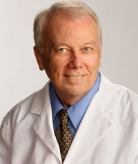

### อนุมูลอิสระ (Free Radical)
เป็นของเสียที่เกิดจากการสันดาปในร่างกายหรือจะเรียกได้ว่า อนุมูลอิสระ (Free Radical) เป็นสนิมของเซลล์ในร่างกายเราหากร่างกายมีอนุมูลอิสระเยอะเกินไป อาจจะก่อให้เกิดปัญหาตามมา คือ การอักเสบโดยเฉพาะกับระบบหัวใจและหลอดเลือดอาจเกิดปัญหาเส้นเลือดในสมองตีบ หัวใจขาดเลือด อัลไซเมอร์ในระบบอื่นอาจจะทำให้เกิด โรคไขข้ออักเสบ ลำไส้แปรปรวนและหากมีอนุมูลอิสระมากที่โครงสร้างระบบผิวหนังเนื้อเยื่อ อาจจะก่อให้เกิดการแก่เหี่ยวย่น หย่อนคล้อยของผิวได้เร็วและมากกว่าคนอื่น

### SOD (Super Oxide Dismutate) 
ร่างกายของเรามีกลไกในการกำจัดอนุมูลอิสระ (Free Radical) อยู่ในตัวเองอยู่แล้วที่เรียกว่า “สารต้านอนุมูลอิสระ (Anti-Oxidant)” ซึ่งร่างกายสร้างได้เองอยู่แล้วเรียกว่า SOD (Super Oxide Dismutate) แต่เมื่อเราอายุมากขึ้นกระบวนการต้านอนุมูลอิสระเสื่อมลง ผู้ที่เป็นส่วนสำคัญที่ช่วยให้ร่างกายสร้าง SOD ก็คือ Nrf2

### Nrf2
Nrf2 เป็นโปรตีนที่อยู่ในเซลล์ทำหน้าที่ไปบอกให้ร่างกายสร้าง SOD เพื่อไปต้านอนุมูลอิสระ SOD สามารถต้านอนุมูลอิสระได้ในสัดส่วน 1 ต่อ 1,000,000 หน่วย ทุกๆวินาที

### Professor Joe M. McCord
คือผู้ที่ค้นพบทฤษฎีความเสื่อมและยังเป็นผู้ที่ค้นพบวิธีกระตุ้น ให้ร่างกายต้านอนุมูลอิสระ คือไปกระตุ้น Nrf2 ให้ทำงานเพื่อให้ร่างกายสร้าง SOD นั่นเอง

