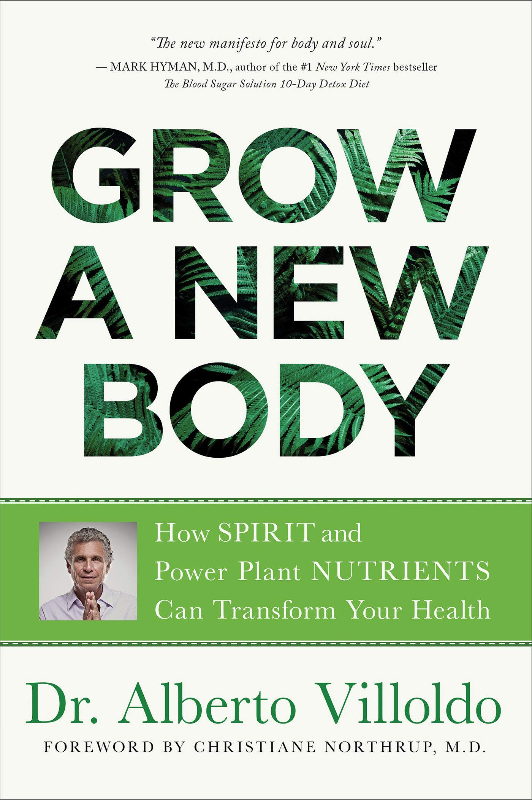

# มารู้จัก Nrf2 จากหนังสือ "Grow a new body"

ฉันเปรียบเทียบว่า Nrf2 เป็นเสมือนหน่วยซีลของกองทัพเรือสหรัฐอเมริกา ซึ่งปกติแล้วจะอยู่ในฐานทัพ นั่งดื่มกาแฟ (หรือชาเขียว) จนกว่าจะถูกเรียกให้ลงมือปฏิบัติแล้วเข้าไปในนิวเคลียสของเซลล์และเข้าไปใน DNA จัดการกวาดล้างผู้ก่อการร้าย (อนุมูลอิสระ) และปรับสวิทซ์ยีนแห่งการมีอายุยืน SIRT-1 เมื่อเสร็จภารกิจพวกเขาก็กลับไปที่เยื่อหุ้มเซลล์และเฝ้าระวังอย่างตื่นตัวต่อไป

นักวิจัยพบว่า Nrf2 อาจเป็นตัวควบคุมหลักของกระบวนการสร้างความชรา นักวิทยาศาสตร์ที่มหาวิทยาลัยเท็กซัสอ้างว่า “การส่งสัญญาณของ Nrf2 . . กระตุ้นการทำงานของยีนมากกว่า 200 ยีนที่มีความสำคัญในการเผาผลาญยาและสารพิษ ป้องกันความเครียดออกซิเดชัน และต้านการอักเสบ รวมทั้งมีบทบาทสำคัญในความเสถียรของโปรตีนและในการกำจัดโปรตีนที่เสียหายผ่านการย่อยสลายของโปรตีนหรือที่เรียกว่า autophagy”

I like to think of Nrf2 as the U.S. Navy SEALS, who are normally in a military base drinking coffee (or green tea) until they are called to action and then go into the nucleus of the cell and into the DNA, cleaning up the terrorists (free radicals) and switching on the SIRT-1 longevity genes, when their job is done, they return to the cell membrane and remain on alert.

Researchers have found that Nrf2 might be the master regulator of the aging process. Scientists at the University of Texas claim that “the Nrf2-signaling . . . activates more than 200 genes that are crucial in the metabolism of drugs and toxins, protection against oxidative stress and inflammation, as well as playing an integral role in stability of proteins and in the removal of damaged proteins via proteasomal degradation or autophagy.”

